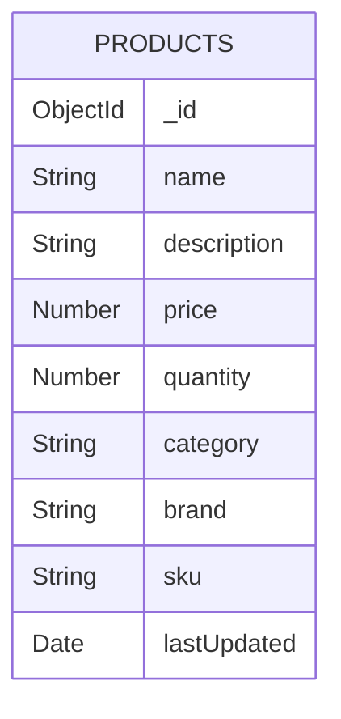

# Diagrama de Base de Datos - Sistema de Inventario

## Colección: Products



## Descripción de Campos

### Products Collection

| Campo | Tipo | Descripción | Restricciones |
|-------|------|-------------|---------------|
| _id | ObjectId | Identificador único de MongoDB | Auto-generado |
| name | String | Nombre del producto | Required, Trimmed |
| description | String | Descripción detallada del producto | Required |
| price | Number | Precio unitario del producto | Required, Min: 0 |
| quantity | Number | Cantidad en inventario | Required, Min: 0 |
| category | String | Categoría del producto | Required |
| brand | String | Marca del producto | Required |
| sku | String | Código único del producto | Required, Unique |
| lastUpdated | Date | Fecha de última actualización | Default: Date.now |

## Índices

### Índices de Texto
- Índice compuesto de texto en `name` y `description` para búsquedas textuales
```javascript
{ name: 'text', description: 'text' }
```

### Índices Compuestos
- Índice compuesto en `category` y `brand` para filtrado eficiente
```javascript
{ category: 1, brand: 1 }
```

## Relaciones y Restricciones

1. **Unicidad**
   - El campo `sku` debe ser único en toda la colección
   - El `_id` es único por defecto (MongoDB)

2. **Validaciones**
   - Todos los campos marcados como Required son obligatorios
   - `price` y `quantity` no pueden ser negativos
   - `name` se limpia de espacios en blanco extras

3. **Valores por Defecto**
   - `lastUpdated` se establece automáticamente a la fecha actual

## Ejemplo de Documento

```json
{
  "_id": ObjectId("507f1f77bcf86cd799439011"),
  "name": "Laptop HP Pavilion",
  "description": "Laptop HP Pavilion 15.6 pulgadas, 8GB RAM, 256GB SSD",
  "price": 799.99,
  "quantity": 25,
  "category": "Electrónicos",
  "brand": "HP",
  "sku": "HP-PAV-001",
  "lastUpdated": ISODate("2023-12-27T12:00:00Z")
}
```

## Notas de Diseño

1. **Escalabilidad**
   - La estructura permite agregar fácilmente nuevos campos si es necesario
   - Los índices están optimizados para las operaciones más comunes

2. **Rendimiento**
   - Índices estratégicos para búsquedas frecuentes
   - Estructura desnormalizada para acceso rápido

3. **Mantenibilidad**
   - Campos con nombres descriptivos
   - Tipos de datos apropiados para cada campo
   - Restricciones claras y documentadas 